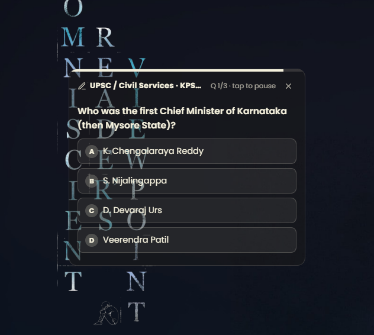
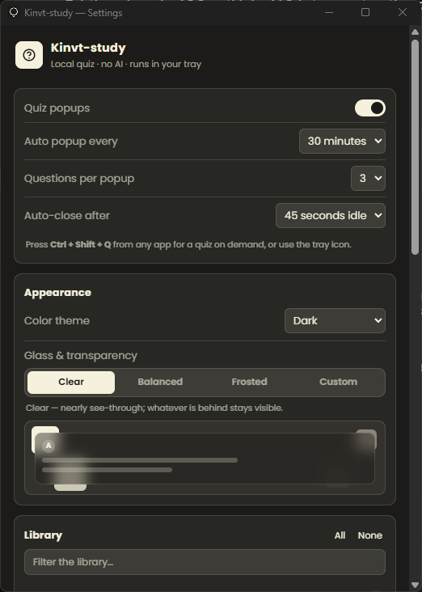
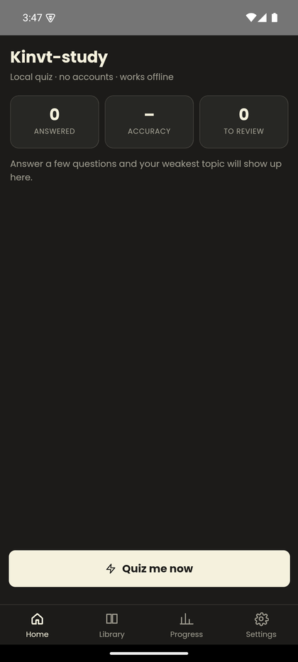
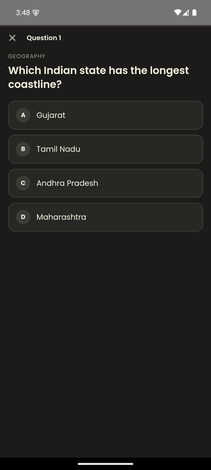
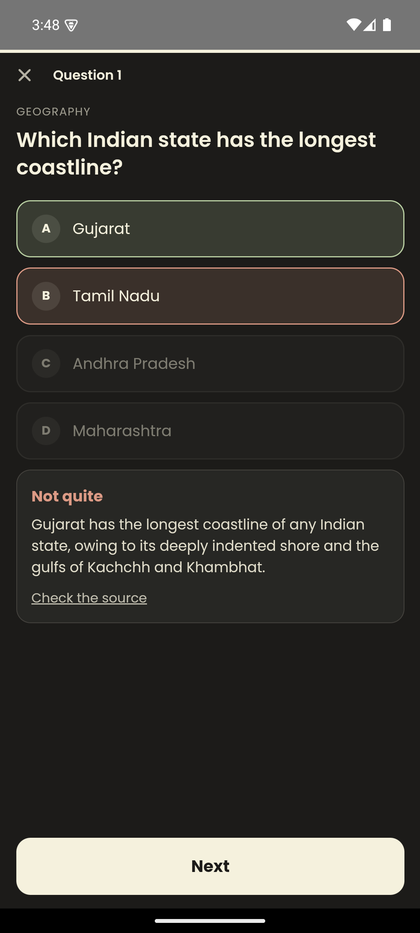
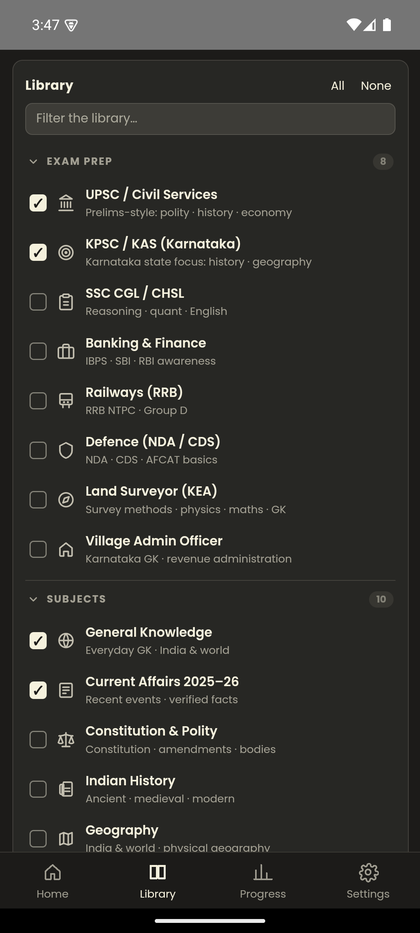
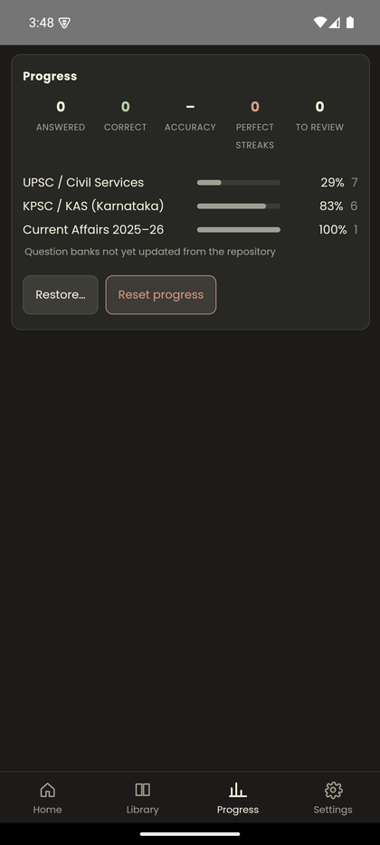
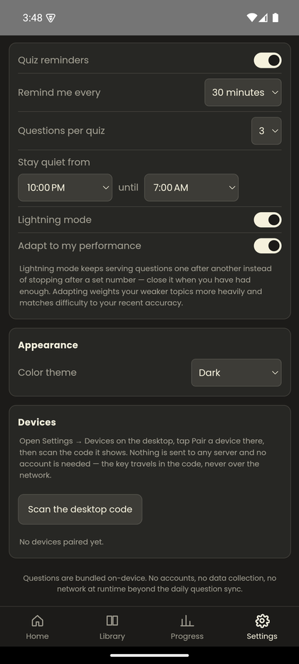

# Kinvt-study — Smart Quiz

A translucent, always-on-top MCQ quiz popup for competitive-exam prep. It sits in your system tray and, on a schedule you choose, floats a frosted-glass card over whatever you're doing with 1–5 questions — General Knowledge, UPSC, KPSC/KAS, SSC, Banking and more, across 336 bundled questions in 16 topics. Local-first: the app itself runs entirely offline against static JSON, calls no model, and collects nothing. Most topics are hand-written; the current-affairs bank is refreshed monthly by an automated pipeline ([docs/AUTOMATION.md](docs/AUTOMATION.md)).

There is an **Android app** too, built from the same UI — see [Android](#android).

## Screenshots

**Desktop.** The card floats over whatever you're doing, as see-through as you
care to make it — the preset below is *Clear*, with the wallpaper reading
straight through the glass.

<p align="center">
  
  &nbsp;
  
</p>

**Android.** The same banks, the same progress, the same review queue — but a
phone is not a tray icon, so it is a normal four-tab app and the quiz owns the
screen rather than hovering over it.

<p align="center">
  
  
  
</p>
<p align="center">
  
  
  
</p>

## Setup

Download the installer from Releases, or build it yourself — see
[docs/DESKTOP_BUILD.md](docs/DESKTOP_BUILD.md).

There are two shells over the same UI. **Tauri is what you want**; Electron
exists as a fallback for machines without a C++ toolchain.

| | Tauri | Electron |
|---|---|---|
| Executable | **3.3 MB** | 78 MB |
| Idle memory | **29 MB**, 1 process | 92 MB, 4 processes |
| Needs | Rust + MSVC linker | Node + npm only |

```bash
cd desktop/tauri && cargo build --release   # -> target/release/kinvt-study.exe
```

**Using it**

- Running the .exe opens **Settings** so you can see it started. Close that
  window and it keeps running in the tray — it does not quit.
- It lives in the **system tray** — right-click for *Quiz me now*, *Settings*,
  or *Quit*. On Windows 11 new tray icons are hidden in the overflow flyout:
  click the **`^`** chevron near the clock, and drag the icon out to pin it.
- Press **Ctrl + Shift + Q** from any application for a quiz on demand.
- Otherwise it pops up on its own every 15 minutes – 2 hours, configurable in Settings.

## Android

Capacitor 6 wrapping the same `desktop/ui/`. There is no second codebase:
`scripts/build-mobile-www.mjs` generates `mobile/www/` from the shared UI and
injects the handful of shims a phone needs — native storage, local
notifications, the camera, and a purpose-built quiz screen. Both `mobile/www/`
and `mobile/android/` are generated and gitignored.

What is deliberately *not* carried over is the part that only means something
on a desktop. A floating window's transparency, an auto-close timer and a
"stay quiet while I'm busy" toggle are all meaningless on a phone, so the
Android build strips them rather than showing controls that adjust nothing.

```bash
node scripts/build-mobile-www.mjs
cd mobile && npm install
npx cap add android
node ../scripts/patch-android-manifest.mjs   # permissions, SDK level, signing
node ../scripts/make-android-icons.mjs       # launcher icons from the desktop mark
npx cap sync android
cd android && ./gradlew assembleDebug
```

Both patch scripts must be re-run after any `cap add android`, since
`mobile/android/` is regenerated from scratch.

**Status:** the APK builds, runs and syncs, but it is not on the Play Store and
the released APK is unsigned — see
[docs/RELEASE-PLAN-ANDROID.md](docs/RELEASE-PLAN-ANDROID.md) for exactly what
is left and what has been verified on real hardware versus an emulator.

## Why a desktop app and not a browser extension

This started as a Chrome/Firefox extension. The popup needed to be transparent, frameless, always-on-top and independent of the browser — and a browser extension can't do all four:

- Extension popup windows **can't be transparent** (an OS window has an opaque backing surface and no page behind it to show through) and **can't drop their title bar** — browsers enforce that so pages can't impersonate native windows.
- An in-page overlay can be transparent and chromeless, but **lives in one tab's DOM**, so it dies when you switch tabs or minimise the browser.

Those are browser security boundaries, not missing features. A native window has none of them, so the app does what the extension structurally never could.

## Documentation

- [docs/DESKTOP_BUILD.md](docs/DESKTOP_BUILD.md) — building the .exe, toolchain prerequisites, previewing the UI without building.
- [docs/ARCHITECTURE.md](docs/ARCHITECTURE.md) — the shell, the shared `ui/` folder, and why the shell owns so little.
- [docs/CONTENT.md](docs/CONTENT.md) — question schema, adding topics, the daily sync.
- [docs/TROUBLESHOOTING.md](docs/TROUBLESHOOTING.md) — nothing appears, card cut off, grey halo, build failures.
- [mobile/README.md](mobile/README.md) — the Android build in detail.
- [docs/RELEASE-PLAN-ANDROID.md](docs/RELEASE-PLAN-ANDROID.md) — what is left before the app can ship, and what is verified versus assumed.
- [docs/HANDOFF-ANDROID.md](docs/HANDOFF-ANDROID.md), [docs/HANDOFF-DESKTOP.md](docs/HANDOFF-DESKTOP.md) — context for picking either half up fresh.
- [docs/ERROR_HANDLING.md](docs/ERROR_HANDLING.md), [docs/FAQ.md](docs/FAQ.md)

## License

MIT — see [LICENSE](LICENSE).
